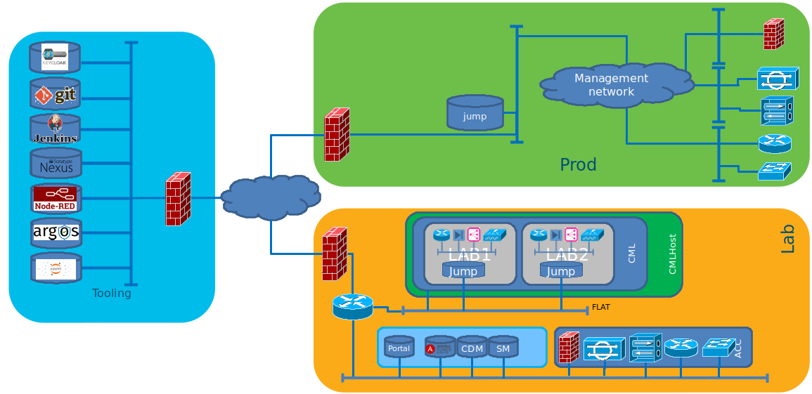
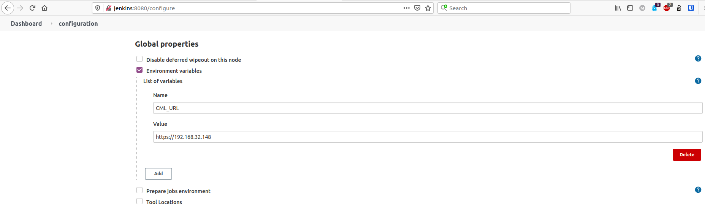
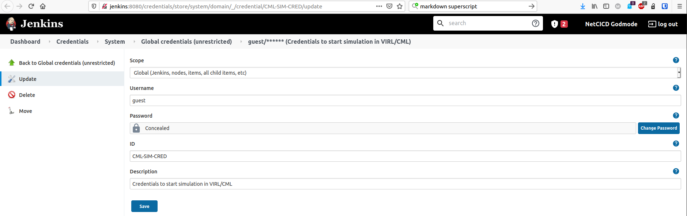

# Background
When working on [NetCICD](https://github.com/Devoteam/NetCICD), again and again, tools used changed their way of use. In addition, additional functionality was needed: some sort of SSO, git, etc. Adding more tools made the tool chain more brittle every time. And what was worse: building it using VM ate CPU and memory, basically limiting the size of the simulations that can be done. In short: having a dependable pipeline is one complex thing, making sure it keeps on working is another.

With the amazing team of DevOps specialists at Devoteam, we started to develop a basic devops toolchain, containing most things you might need to get started on the click of a button. It is pre-configured and can be used to jumpstart a CICD project and based upon Docker to minimise the footprint on a local machine. 

Tooling only has to make your life easier, after all Tech is for People, not the other way around. This is the place where we do this. We are far from finished. Feel free to contribute.

# Want we want to achieve
Having a well functioning tool chain can save a lot of time. But automation is also the fastest way to destroy your business. That is why we want to build a setup that is predictable and reliable:



As you can see, the tool chain is separated from the managed environments. This allows to use a single toolset for all environments. 

In every environment you'll see a jump host. This jump host is the only system that can connect back to the tool chain. It is controlled from Jenkins.

For more information on the systems used and the setup of the individual systems, look at the wiki.

# How to install

### Work in progress!!
Even though we try to make this work as well as we can, it is being improved daily. Master should work, Develop is the most complete.
### Software configuration

The setup has been developed and tested on a fully updated Ubuntu 22.04.3 minimal install, 50 GB disk, 4 CPU, 20 GB memory on KVM with Internet access. As the setup also uses local networking, using the Ubuntu Desktop version is easier. During install testing the minimal install is used. 

After install, execute:

```
sudo wget -O- https://apt.releases.hashicorp.com/gpg | sudo gpg --dearmor -o /usr/share/keyrings/hashicorp-archive-keyring.gpg
echo "deb [signed-by=/usr/share/keyrings/hashicorp-archive-keyring.gpg] https://apt.releases.hashicorp.com $(lsb_release -cs) main" | sudo tee /etc/apt/sources.list.d/hashicorp.list
sudo apt-get update && sudo apt-get upgrade -y
```

```
sudo apt-get update
sudo apt-get install ca-certificates curl
sudo install -m 0755 -d /etc/apt/keyrings
sudo curl -fsSL https://download.docker.com/linux/ubuntu/gpg -o /etc/apt/keyrings/docker.asc
sudo chmod a+r /etc/apt/keyrings/docker.asc

# Add the repository to Apt sources:
echo \
  "deb [arch=$(dpkg --print-architecture) signed-by=/etc/apt/keyrings/docker.asc] https://download.docker.com/linux/ubuntu \
  $(. /etc/os-release && echo "$VERSION_CODENAME") stable" | \
  sudo tee /etc/apt/sources.list.d/docker.list > /dev/null
sudo apt-get update
```

```
sudo apt -y install gh openjdk-17-jre-headless git docker.io docker-compose-plugin docker-buildx curl python3 python3-pip python-is-python3 jq vim xauth iputils-ping make build-essential wget terraform vault direnv
```

```sudo usermod -aG docker ${USER}```

```sudo su - ${USER}```

```sudo python3 -m pip install robotframework robotframework-selenium2library robotframework-debuglibrary pulp-cli[pygments] pulp-cli-deb --break-system-packages```

```echo "export COMPOSE_DOCKER_CLI_BUILD=1" >> ~/.bashrc```

``` echo 'eval "$(direnv hook bash)"' >> ~/.bashrc ```

Go to the [Trivy site](https://aquasecurity.github.io/trivy/v0.31.3/getting-started/installation/) to install trivy.

Install [Docker Buildkit](https://docs.docker.com/build/buildkit/#getting-started):

```sudo vi /etc/docker/daemon.json``` and paste:

```
{
  "features": {
    "buildkit": true
  }
} 
```

Reboot to make sure all changes are activated. You will probably get a popup to do that through the software updater anyway.

Install the [CICD-toolbox](https://github.com/myref/cicdtoolbox):

Create gh login: ```gh auth login``` and follow the prompts.

```git clone https://github.com/myref/cicdtoolbox.git```

```cd cicdtoolbox/```

```
mkdir .config/pulp
```

Copy the pulp config:

```cp pulp/cli.toml ~/.config/pulp/cli.toml```


```direnv allow```

After this, you can run:

```./runonce ```

You need to be able to run docker as non-root. See [here](https://docs.docker.com/engine/install/linux-postinstall/) for details.

### Do NOT run this script after use.
* The script stops all existing containers
* It wipes all working directories, networks, containers and builds
* Networks are preconfigured to enable the connect-back from CML
* Running or starting twice will create failing networks and/or containers, duplicate IP addresses and all kinds of other mayhem.


## Users ##
All users are configured in LLDAP. [The wiki](https://github.com/Devoteam/CICD-toolbox/wiki/Users-and-passwords) has the complete list.

### Wat the Robot script does ###
In order for Jenkins to be able to run the jenkinsfiles, jenkins needs the jenkins-jenkins user to have a token.

* Go to http://jenkins:8080/user/jenkins-jenkins/configure (jenkins-jenkins/netcicd). 
* Add the token. Copy this token, and paste it into a temporary file. Log out.
* Go to http://jenkins:8080/credentials/store/system/domain/_/credential/jenkins-jenkins/update (netcicd/netcicd)
* Click Change Password and paste the token there. Delete the temporary file.

In order for Jenkins to be able to scan git, the git-jenkins users needs to log in once.

* Go to http://gitea:3000/user/login?redirect_to=%2f
* Log in as (git-jenkins/netcicd) and set the password. You must use the same password as used in Jenkins Credentials git-jenkins. Use something safe.

## About Cisco Modeling Labs installation ##
### Reachability ###
The pipeline is initially developed to work with Cisco Modeling Labs Personal Edition, but will work with any Jenkinsfile you feed the pipeline. In order to work with CML PE, you can use a stock install, but it needs a fixed IP address. The address configured in the pipeline is 192.168.32.148. If you used a different address, you need to change this in [Jenkins](http://jenkins:8080/configure), look for Global Properties and change the IP address at CML-URL.



### User ###
The default username/password for CML is guest/guest as it was in VIRL. With CML<sup>2</sup>, this is no longer accepted, and needs to be changed. As explained after install, this must be done in Jenkins. Go to [Jenkins Credentials ->CML-SIM-CRED](http://jenkins:8080/credentials/store/system/domain/_/credential/CML-SIM-CRED/update) and change the credentials to thos you use to log in to CML<sup>2</sup>.



# License #
This Source Code Form is subject to the terms of the Mozilla Public License, v. 2.0. If a copy of the MPL was not distributed with this file, You can obtain one at http://mozilla.org/MPL/2.0/.
## Copyright ##
(c) Mark Sibering

